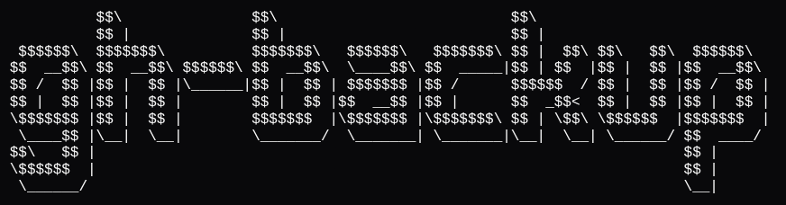
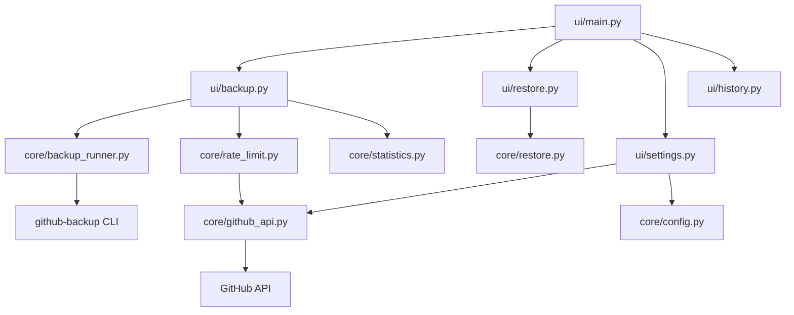
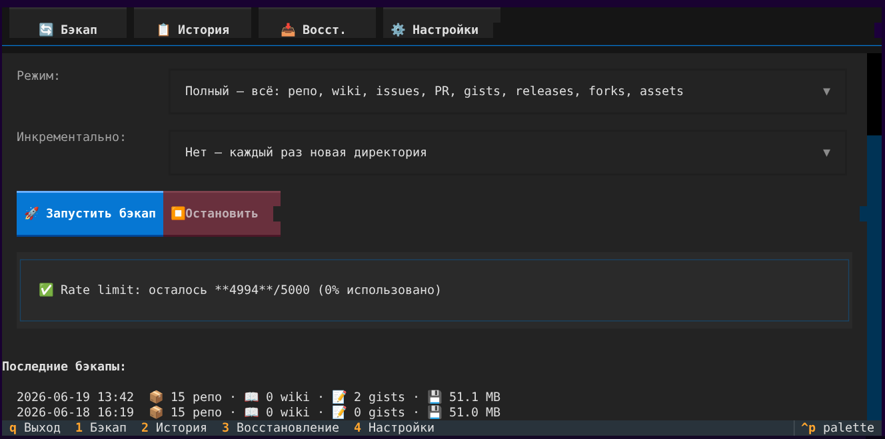
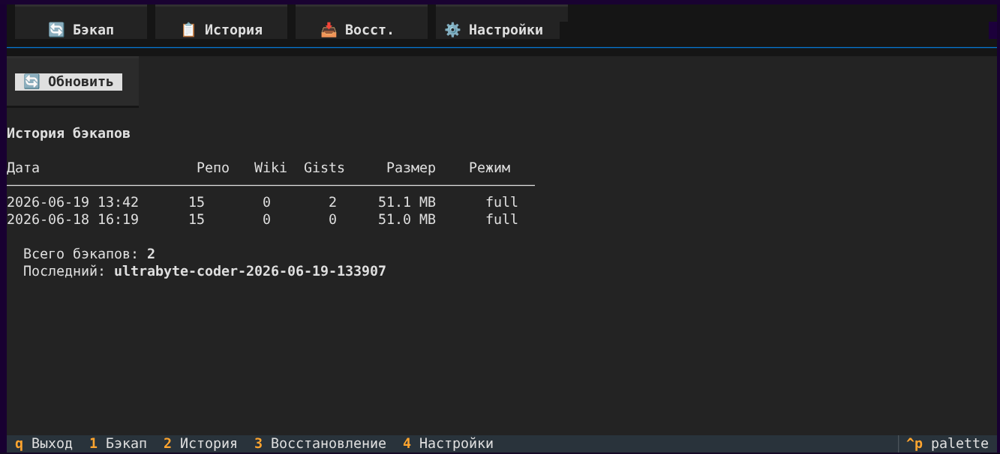
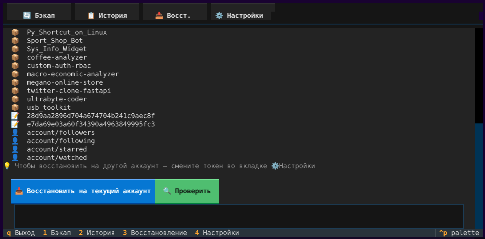
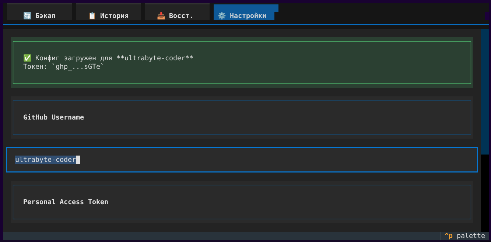

# gh-backup



**Python 3.11+** | **MIT** | **109 tests** | **90% coverage**

> TUI для полного бэкапа и восстановления GitHub-аккаунта.

```
python -m ui
```
mimo -s ses_125addc5bffeRbk9MRYyHEhHjk
---

## Возможности

| Функция | Описание |
|---------|----------|
| **Бэкап** | Репозитории (git mirror), wiki, gists, issues, PR, releases, forks, labels, milestones, assets, starred |
| **Восстановление** | git push --mirror репо/wiki/gists на текущий аккаунт |
| **История** | Список всех бэкапов с датами и размерами |
| **Настройки** | Ввод и проверка username/token через GitHub API |
| **Rate Limit** | Автопроверка лимитов, блокировка при приближении к потолку |
| **Логирование** | Каждый бэкап пишет лог в `backups/backup.log` |
| **Уведомления** | Системные нотификации по завершении бэкапа (Linux/macOS/Windows) |

### Что входит в каждый режим

| Категория | Полный | Быстрый |
|-----------|--------|---------|
| Репозитории (mirror) | Yes | Yes |
| Приватные репо | Yes | Yes |
| Форкнутые репо | Yes | -- |
| Wiki | Yes | Yes |
| Issues + комментарии | Yes | -- |
| Pull Requests + детали | Yes | -- |
| Labels + milestones | Yes | -- |
| Releases + assets | Yes | -- |
| Gists + starred gists | Yes | -- |
| Starred repos (ссылки) | Yes | -- |
| Attachments | Yes | -- |
| Hooks | Yes | -- |
| Security advisories | Yes | -- |
| Followers / Following | Yes | -- |
| Watched repos | Yes | -- |

---

## Архитектура



| Модуль | Роль |
|--------|------|
| `core/backup_runner.py` | Запуск и управление процессом бэкапа |
| `core/config.py` | Валидация и хранение настроек (.env) |
| `core/github_api.py` | Проверка токена, юзера, rate limit |
| `core/rate_limit.py` | Защита от превышения лимитов API |
| `core/restore.py` | Сканирование и восстановление из бэкапов |
| `core/statistics.py` | Подсчёт статистики по бэкапам |
| `ui/main.py` | TUI-приложение, навигация по вкладкам |
| `ui/backup.py` | Вкладка запуска бэкапа |
| `ui/restore.py` | Вкладка восстановления |
| `ui/settings.py` | Вкладка настроек |
| `ui/history.py` | Вкладка истории |

---

## Быстрый старт

### 1. Установка

```bash
git clone <repo-url>
cd gh-backup
python3 -m venv .venv
source .venv/bin/activate
pip install -e .
```

### 2. Настройка

```bash
cp .env.example .env
```

Отредактируй `.env` — впиши username и token. Или запусти TUI и настрой через вкладку «Настройки» (`4`).

### 3. Запуск

```bash
python -m ui
```

---

## Навигация

| Клавиша | Действие |
|---------|----------|
| `1` | Вкладка «Бэкап» |
| `2` | Вкладка «История» |
| `3` | Вкладка «Восстановление» |
| `4` | Вкладка «Настройки» |
| `Tab` | Переключение между полями |
| `Enter` | Нажать кнопку |
| `q` | Выход |

Мышь тоже работает.

---

## Скриншоты

<details>
<summary>Вкладка «Бэкап»</summary>


</details>

<details>
<summary>Вкладка «История»</summary>


</details>

<details>
<summary>Вкладка «Восстановление»</summary>


</details>

<details>
<summary>Вкладка «Настройки»</summary>


</details>

---

## Rate Limit

GitHub API: **5000 запросов в час** на токен. Сброс — каждый час.

### Уровни защиты

| Осталось | Индикатор | Действие |
|----------|-----------|----------|
| >= 1000 | Зелёный | ОК |
| 500-999 | Жёлтый | Рекомендуется подождать |
| 200-499 | Красный | Кнопка заблокирована |
| < 200 | Заблокировано | Полная блокировка + автопауза |

### Расход запросов

| Тип бэкапа | Запросов |
|------------|----------|
| Быстрый (repo + wiki) | 50-200 |
| Полный (50 репо) | 2000-4000 |
| Инкрементальный | 100-500 |

<details>
<summary>Проверка лимита вручную</summary>

```bash
curl -H "Authorization: token ГП_ТОКЕН" https://api.github.com/rate_limit
```

</details>

<details>
<summary>Важно: flagged account</summary>

При частых запросах GitHub может заблокировать аккаунт:

> Flagged account and cannot authorize third-party applications

Решение: подождите несколько часов. Используйте инкрементальный режим и не делайте полный бэкап чаще раза в сутки.

</details>

---

## Безопасность

- Токен в `.env` с правами `600` (только владелец)
- Lock-файл от параллельных запусков
- Rate limit проверка перед каждым бэкапом
- Throttling при < 200 запросах
- Логирование в `backups/backup.log`

---

## Восстановление

<details>
<summary>Через TUI</summary>

1. Вкладка «Восстановление» (`3`)
2. Выбери бэкап из списка
3. Нажми «Проверить» — git fsck
4. Нажми «Восстановить»

</details>

<details>
<summary>Вручную</summary>

```bash
cd backups/user-*/repositories/репо/repository
git remote set-url origin https://github.com/USER/репо.git
git push --mirror origin
```

</details>

---

## Тестирование

```bash
pip install -e ".[dev]"
pytest -v                          # все тесты
pytest --cov=core --cov-report=term-missing  # с покрытием
ruff check .                       # линтер
mypy core/ ui/ --ignore-missing-imports      # типизация
```

| Модуль | Покрытие |
|--------|----------|
| `github_api.py` | 100% |
| `rate_limit.py` | 100% |
| `config.py` | 97% |
| `statistics.py` | 96% |
| `backup_runner.py` | 86% |
| `restore.py` | 79% |
| **Итого** | **90%** |

---

## Зависимости

| Пакет | Зачем |
|-------|-------|
| `textual` | TUI-фреймворк |
| `httpx` | HTTP-клиент для GitHub API |
| `pydantic` | Валидация конфигурации |
| `github-backup` | Движок бэкапа ([josegonzalez/python-github-backup](https://github.com/josegonzalez/python-github-backup)) |

---

## Лицензия

[MIT](LICENSE)

---

## Благодарности

- [python-github-backup](https://github.com/josegonzalez/python-github-backup) -- движок бэкапа
- [Textual](https://textual.textualize.io/) -- TUI-фреймворк
